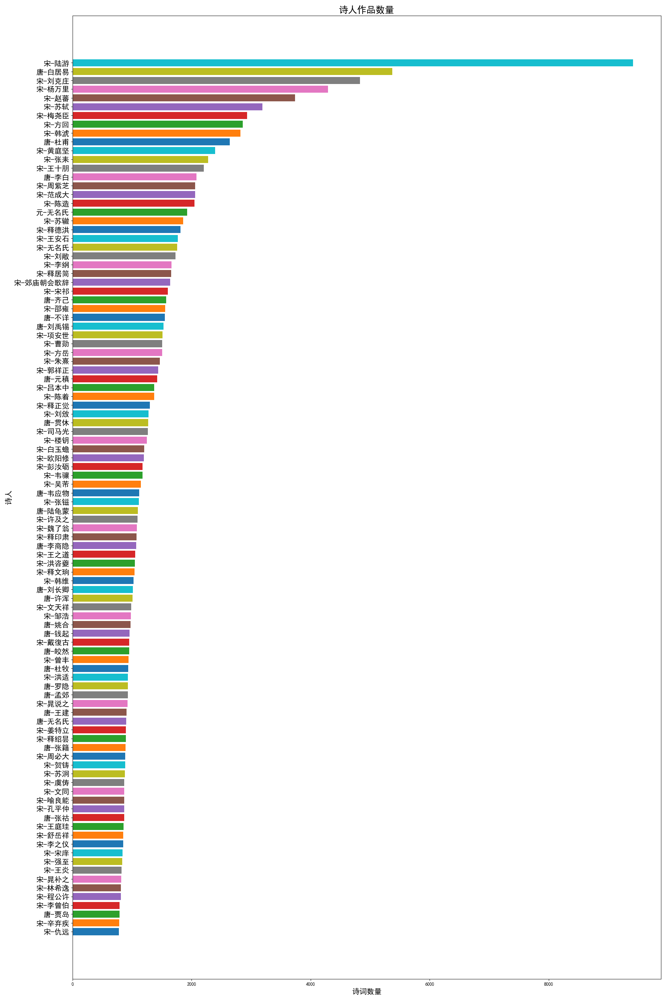
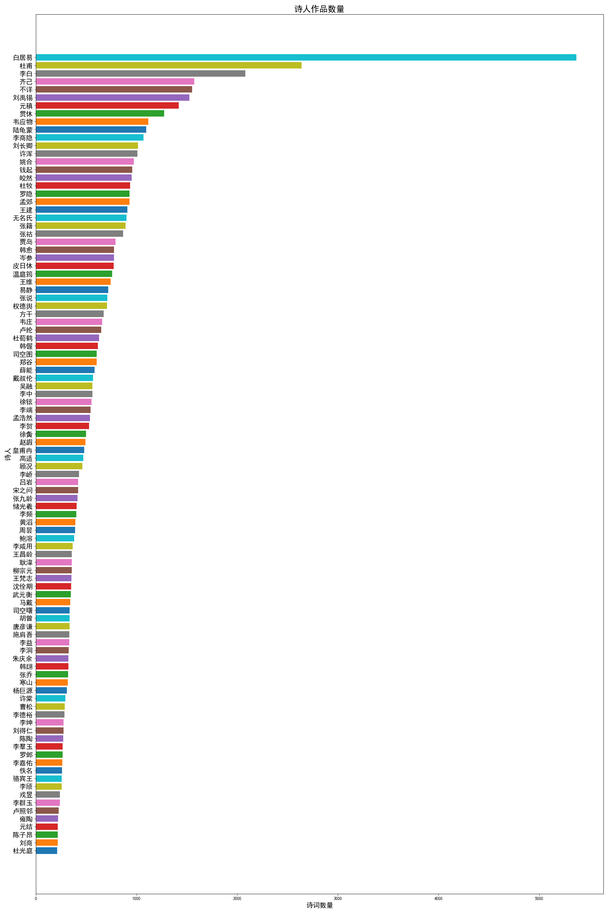
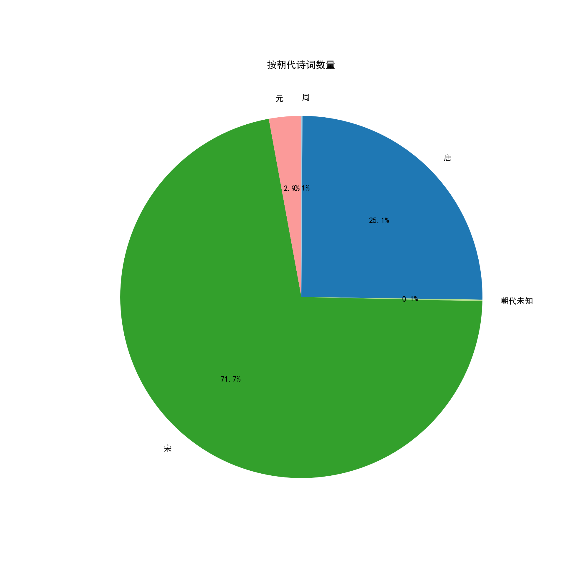

# 关于《诗歌总集》

  **全网最全的诗词数据集！目前累计收录37万首诗词曲赋，共分为370卷，每卷1000首，见 ./volumes 目录。**
  
  互联网发达的时代，我们依然很难找到一个非常系统、完善、高质量的诗词数据集合。思考了很长时间，决定创建《诗歌总集》这个github repo。借助收集的数据，以及LLM（大语言模型）的能力从下面几个维度去不断完善这个项目。
  
- [x] 收录：收录所有中文诗词
- [x] 校正：内容来源于网络，矫正诗词内容*
- [ ] 鉴赏：鉴赏、翻译、考究诗词的创作背景
- [ ] 评分：从不同角度对诗词进行评分评级*


*诗词中存在很多字已经不在使用、甚至在电脑上没有可用的编码表示，这一类问题的处理是比较费时的

*文学的好坏既是客观的也是主观的，量化的评分是困难的，但是为了让好的诗词在数十万首诗词中更容易地进入到大家的视线，数值化是一个最高效的方式之一

# 重要的事情
【2024/12/19】更新：最近在做一个非常有趣的事情，AI辅助的诗歌鉴赏工作、诗歌题材的图片制作，目前看起来效果挺好的，2025年到来之前我争取发布一个重要的更新！审美真的太重要了。

文学属于所有人！

【2024/12/21】更新：统一poetry uuid，去重了8637首诗歌。
【2024/12/22】更新：修改为content hash为uuid，去重了5000首诗歌。

# 诗歌数据

### 诗人作品数量分布
按照作品数量，排第一的是宋代诗人陆游，共收录诗歌9400余首，第二是白居易，共有诗歌5370首，第三是宋代诗人刘克庄，4800余首。




### 唐朝诗人作品数量分布
在唐代的诗词作品中，按照作品数量，前三分别位：白居易、杜甫、李白。其实按照诗歌的成就水平来说，他们也可以算是前三。




### 朝代作品数量分布
按照作品数量，排第一的是宋代，第二的是唐代。（未超过0.1%的数据暂未展示）




# 已收录内容 【更新中】

从最早的《诗经》到清朝的诗人作品，收录各个朝代的所有诗词曲赋以及部分散文，按照时间先后包括：
- [x] 周：《诗经》、《论语》、《离骚》等
- [x] 汉代：《古诗十九首》等
- [x] 三国：《曹植诗集》等
- [x] 两晋：《陶渊明集》等
- [x] 唐代：《唐诗三百首》、《全唐诗》等
- [x] 宋代：《宋词三百首》、宋诗、宋词
- [x] 元代：元曲
- [ ] 清代：纳兰性德诗集，曹雪芹《红楼梦》诗歌


# 数据格式

每一首诗词统一数据建模，标准化为如下的json格式，所有内容使用将简体中文
```json
{
        "uuid": "hash of title-author-content, with all spaces, and new lines removed before hashing",
        "title": "相和歌辞：蜀道难",
        "author": "李白",
        "content": "噫吁嚱，危乎高哉！蜀道之难，难于上青天。\n蚕丛及鱼凫，开国何茫然。尔来四万八千岁，\n地崩山摧壮士死，然后天梯石栈方钩连。\n上有六龙回日之高标，下有冲波逆折之回川。\n黄鹤之飞尚不得，猿猱欲度愁攀缘。青泥何盘盘，\n问君西游何时还，畏途巉岩不可攀。但见悲鸟号枯木，\n其崄也若此，嗟尔远道之人胡为乎来哉！\n剑阁峥嵘而崔嵬，一夫当关，万夫莫开。所守或匪亲，\n蜀道之难难于上青天，侧身西望长咨嗟。",
        "dynasty": "唐",
        "collection_info": {
            "collection": "御定全唐诗",
            "volume": "卷二十"
        }
    }
```

# TODO
- [ ] 李白全集
- [ ] 杜甫全集
- [ ] 白居易全集
- [ ] 苏轼全集
- [ ] 屈原全集
- [ ] 陶渊明全集
- [ ] 曹植全集
- [ ] 辛弃疾全集


